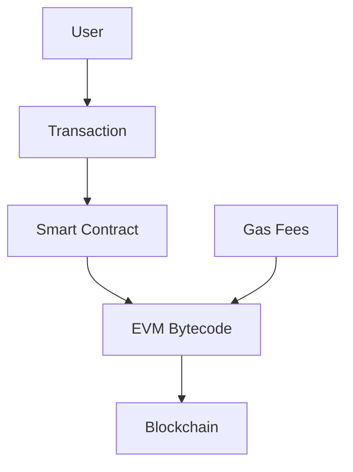
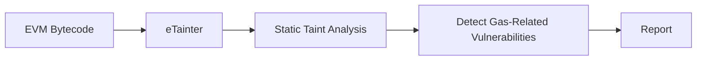
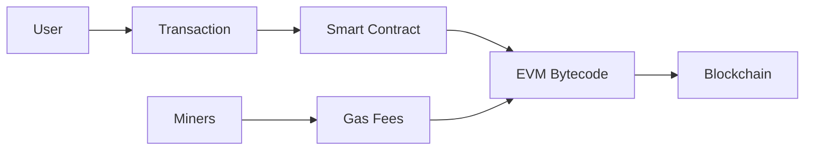
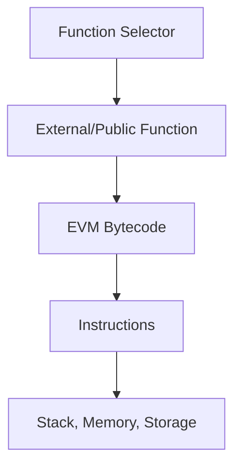
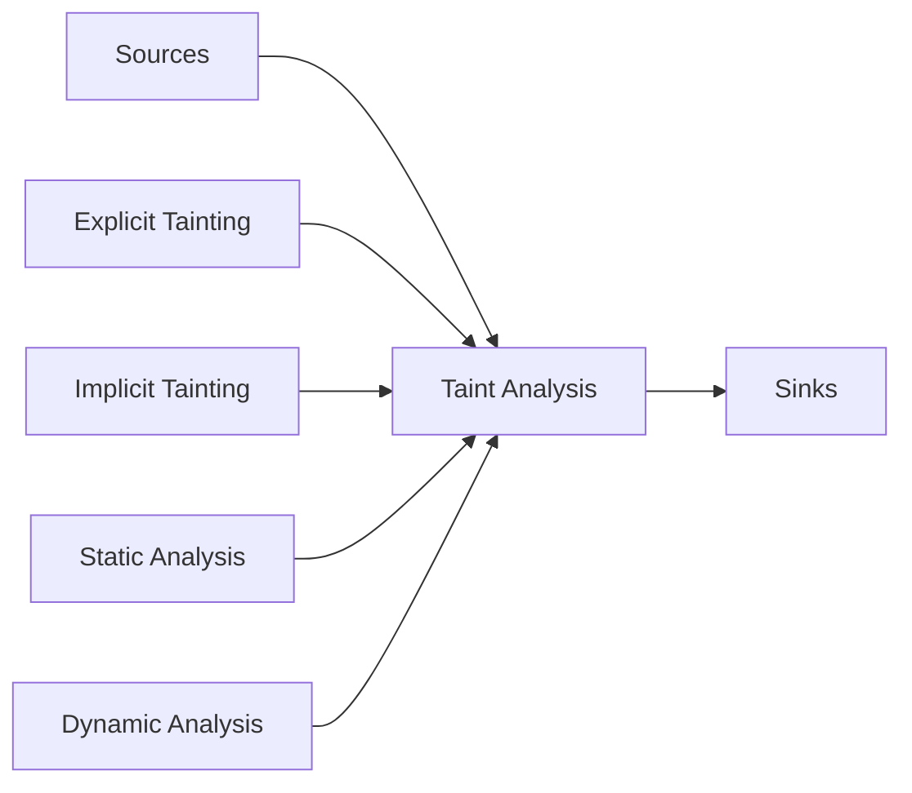
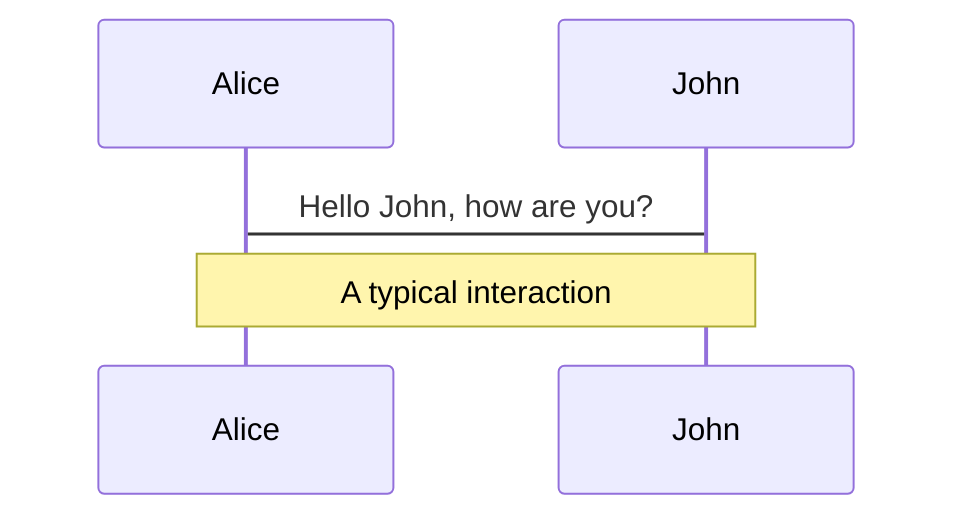
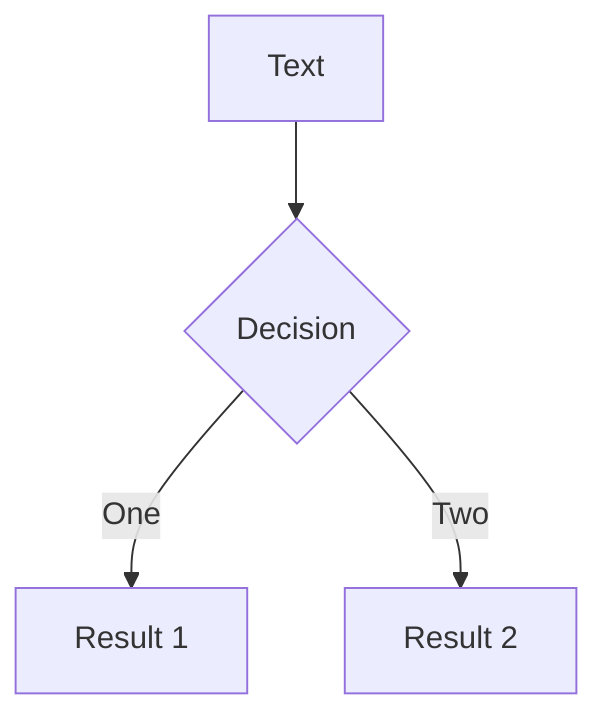
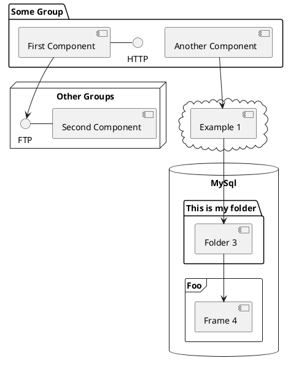

---
# try also 'default' to start simple
theme: seriph
# random image from a curated Unsplash collection by Anthony
# like them? see https://unsplash.com/collections/94734566/slidev
background: https://source.unsplash.com/collection/94734566/1920x1080
# apply any windi css classes to the current slide
class: 'text-center'
# https://sli.dev/custom/highlighters.html
highlighter: shiki
# show line numbers in code blocks
lineNumbers: false
# some information about the slides, markdown enabled
info: |
  ## Slidev Starter Template
  Presentation slides for developers.

  Learn more at [Sli.dev](https://sli.dev)
# persist drawings in exports and build
drawings:
  persist: false
# page transition
transition: slide-left
# use UnoCSS
css: unocss
---

# eTainter: Detecting Gas-Related Vulnerabilities in Smart Contracts

By

Sourena Khanzadeh

<div class="abs-br m-6 flex gap-2">
  <button @click="$slidev.nav.openInEditor()" title="Open in Editor" class="text-xl slidev-icon-btn opacity-50 !border-none !hover:text-white">
    <carbon:edit />
  </button>
  <a href="https://github.com/sourenaKhanzadeh/etainter" target="_blank" alt="GitHub"
    class="text-xl slidev-icon-btn opacity-50 !border-none !hover:text-white">
    <carbon-logo-github />
  </a>
</div>

<!--
The last comment block of each slide will be treated as slide notes. It will be visible and editable in Presenter Mode along with the slide. [Read more in the docs](https://sli.dev/guide/syntax.html#notes)
-->

---
transition: slide-left
---

# Table of Contents

Presentation structure

- 📝 **Abstract**
- 🎨 **Introduction** 
- 🧑‍💻 **Background** 
- 🤹 **Related Work** 
- 🎥 **Proposed Methodology**
- 📤 **Evaluation** 
- 🛠 **Conclsion** 

<br>
<br>

You can find the presentation slides [https://sourenakhanzadeh.github.io/etainter](https://sourenakhanzadeh.github.io/etainter)

<!--
You can have `style` tag in markdown to override the style for the current page.
Learn more: https://sli.dev/guide/syntax#embedded-styles
-->

<style>
h1 {
  background-color: #2B90B6;
  background-image: linear-gradient(45deg, #4EC5D4 10%, #146b8c 20%);
  background-size: 100%;
  -webkit-background-clip: text;
  -moz-background-clip: text;
  -webkit-text-fill-color: transparent;
  -moz-text-fill-color: transparent;
}
</style>

<!--
Here is another comment.
-->

---
transition: slide-right
---

# Abstract

This is a summary of the papers abstract.

<kbd> Keywords </kbd>

The execution of <kbd>smart contracts</kbd> on the <kbd>Ethereum blockchain</kbd> consumes <kbd>gas</kbd>, which may lead to <kbd>gas-related vulnerabilities</kbd> if there is insufficient gas provided. These vulnerabilities can be exploited for malicious purposes, such as <kbd>Denial-of-Service (DoS) attacks</kbd>. This paper introduces <kbd>eTainter</kbd>, a static analyzer that detects gas-related vulnerabilities using <kbd>taint tracking</kbd> in the bytecode of smart contracts. eTainter outperforms the previous work, <kbd>MadMax</kbd>, in precision and recall with a precision of 90%. A large-scale analysis of 60,612 real-world Ethereum contracts reveals that gas-related vulnerabilities exist in 2,763 contracts, and eTainter takes an average of eight seconds to analyze a contract.

---
layout: image-right
image: https://source.unsplash.com/collection/94734566/1920x1080
transition: slide-left
---

# Introduction

Problem statement

- Ethereum smart contracts and gas fees
- Gas-related vulnerabilities and their impact
- Limitations of current tools

<Transform :scale="0.8">

</Transform>

<!-- 
  today we will be discussing the challenges surrounding Ethereum smart contracts, gas fees, and the gas-related vulnerabilities that can negatively impact these contracts. Let's begin by understanding the problem statement.

As we can see from the diagram, when a user submits a transaction to interact with a smart contract, it gets executed on the Ethereum blockchain. During this execution, gas fees are consumed. These gas fees are essential for the proper functioning of the contract and prevent abuse of the system.

However, there is a downside. Smart contracts may contain gas-related vulnerabilities, which can lead to unexpected issues and unwanted behaviors. For instance, if there isn't enough gas provided for a transaction, the execution may halt, and any changes made during the execution will be reverted.

The problem is further exacerbated when malicious actors exploit these vulnerabilities to launch Denial-of-Service (DoS) attacks on the targeted victim contracts. This highlights the need for efficient tools to detect and prevent such gas-related vulnerabilities in smart contracts.

Unfortunately, current tools for detecting these vulnerabilities have limitations. They often rely on pre-specified code templates and rules, which can lead to false positives and a lack of accuracy in identifying the vulnerabilities.

In the next slides, we'll discuss a novel solution called eTainter that aims to address these limitations and effectively detect gas-related vulnerabilities in Ethereum smart contracts.
 -->

---
layout: image-left
image: https://source.unsplash.com/collection/94734566/1920x1080
transition: slide-right
---

# Introduction (cont.)
Proposed Solution

- Efficient static-analysis-based approach
- Formulates detection as a taint analysis problem
- Tracks taints through contract's storage and multiple entry points
- Domain-specific optimizations to reduce false-positives




<!-- 
  Now that we've discussed the problem statement, let's dive into our proposed solution called eTainter, which is designed to address the limitations of existing tools and effectively detect gas-related vulnerabilities in Ethereum smart contracts.

eTainter is an efficient static-analysis-based approach that formulates the detection of gas-related vulnerabilities as a taint analysis problem. By tracking taints through a contract's storage and multiple entry points, it can accurately identify vulnerabilities that may lead to issues like DoS attacks.

One of the key aspects of eTainter is its domain-specific optimizations, which help reduce false positives and improve the overall accuracy of vulnerability detection.

Let's take a closer look at the workflow of eTainter as shown in the diagram:

1. eTainter takes the EVM bytecode of a smart contract as input.
2. It then performs static taint analysis on the bytecode to identify potential vulnerabilities.
3. The analysis helps detect gas-related vulnerabilities that could be exploited by malicious actors.
4. Finally, eTainter generates a report outlining the identified vulnerabilities, enabling developers to take corrective action before deploying the smart contract on the Ethereum blockchain.

By using eTainter, we can better understand the gas-related vulnerabilities in our smart contracts and take necessary precautions to prevent unwanted behavior and potential attacks. In the next slides, we'll discuss the evaluation and results of eTainter and how it compares to existing tools in the field.
 -->

---
transition: fade-out
---

# Background

Ethereum Smart Contracts

- Distributed computing platform
- Stack-based Ethereum Virtual Machine (EVM)
- Persistent private key-value storage
- Volatile memory
- EVM bytecode executed through transactions



---
transition: fade-out
layout: two-cols
---

# Background (cont.)

EVM ByteCode

- Multiple entry points with function selector
- Instructions work on data from stack, memory, or storage
- EVM manages persistent data with SLOAD and SSTORE instructions
- Arithmetic, logic, and control transfer instructions
- No method invocation and return instructions

::right::


---
transition: fade-out
---

<table>
<thead>
    <tr>
        <th>Instruction</th>
        <th>Description</th>
        <th>Opcode</th>
    </tr>
</thead>
<tbody>
    <tr>
        <td>ADD</td>
        <td>Addition operation</td>
        <td>0x01</td>
    </tr>
    <tr>
        <td>MUL</td>
        <td>Multiplication operation</td>
        <td>0x02</td>
    </tr>
    <tr>
        <td>SUB</td>
        <td>Subtraction operation</td>
        <td>0x03</td>
    </tr>
    <tr>
        <td>GT</td>
        <td>Greater-than comparison</td>
        <td>0x11</td>
    </tr>
    <tr>
        <td>EQ</td>
        <td>Equality comparison</td>
        <td>0x14</td>
    </tr>
    <tr>
        <td>JUMPI</td>
        <td>Conditional jump</td>
        <td>0x57</td>
    </tr>
    <tr>
        <td>CALL</td>
        <td>Call another contract</td>
        <td>0xF1</td>
    </tr>
    <tr>
        <td>STOP</td>
        <td>Stop execution</td>
        <td>0x00</td>
    </tr>
    <tr>
        <td>REVERT</td>
        <td>Revert changes made during execution</td>
        <td>0xFD</td>
    </tr>
</tbody>
</table>

<style>
        table {
            border-collapse: collapse;
            width: 100%;
        }
        th, td {
            border: 1px solid black;
            padding: 8px;
            text-align: left;
        }
        th {
            background-color: #f2f2f2;
        }
</style>

---
transition: fade-out
layout: two-cols
---
# Background (cont.)

Taint Analysis

- Used for information-flow-based security
- Identifies data-flow from low-integrity data (sources) to high-integrity data (sinks)
- Explicit and implicit tainting
- Static and dynamic taint analysis
- Static analysis: potentially imprecise but sound
- Dynamic analysis: precise but limited coverage

::right::


---

# Components

<div grid="~ cols-2 gap-4">
<div>

You can use Vue components directly inside your slides.

We have provided a few built-in components like `<Tweet/>` and `<Youtube/>` that you can use directly. And adding your custom components is also super easy.

```html
<Counter :count="10" />
```

<!-- ./components/Counter.vue -->
<Counter :count="10" m="t-4" />

Check out [the guides](https://sli.dev/builtin/components.html) for more.

</div>
<div>

```html
<Tweet id="1390115482657726468" />
```

<Tweet id="1390115482657726468" scale="0.65" />

</div>
</div>

<!--
Presenter note with **bold**, *italic*, and ~~striked~~ text.

Also, HTML elements are valid:
<div class="flex w-full">
  <span style="flex-grow: 1;">Left content</span>
  <span>Right content</span>
</div>
-->


---
class: px-20
---

# Themes

Slidev comes with powerful theming support. Themes can provide styles, layouts, components, or even configurations for tools. Switching between themes by just **one edit** in your frontmatter:

<div grid="~ cols-2 gap-2" m="-t-2">

```yaml
---
theme: default
---
```

```yaml
---
theme: seriph
---
```


</div>

Read more about [How to use a theme](https://sli.dev/themes/use.html) and
check out the [Awesome Themes Gallery](https://sli.dev/themes/gallery.html).

---
preload: false
---

# Animations

Animations are powered by [@vueuse/motion](https://motion.vueuse.org/).

```html
<div
  v-motion
  :initial="{ x: -80 }"
  :enter="{ x: 0 }">
  Slidev
</div>
```

<div class="w-60 relative mt-6">
  <div class="relative w-40 h-40">
    
    
    
  </div>

  <div
    class="text-5xl absolute top-14 left-40 text-[#2B90B6] -z-1"
    v-motion
    :initial="{ x: -80, opacity: 0}"
    :enter="{ x: 0, opacity: 1, transition: { delay: 2000, duration: 1000 } }">
    Slidev
  </div>
</div>

<!-- vue script setup scripts can be directly used in markdown, and will only affects current page -->
<script setup lang="ts">
const final = {
  x: 0,
  y: 0,
  rotate: 0,
  scale: 1,
  transition: {
    type: 'spring',
    damping: 10,
    stiffness: 20,
    mass: 2
  }
}
</script>

<div
  v-motion
  :initial="{ x:35, y: 40, opacity: 0}"
  :enter="{ y: 0, opacity: 1, transition: { delay: 3500 } }">

[Learn More](https://sli.dev/guide/animations.html#motion)

</div>

---

# LaTeX

LaTeX is supported out-of-box powered by [KaTeX](https://katex.org/).

<br>

Inline $\sqrt{3x-1}+(1+x)^2$

Block
$$
\begin{array}{c}

\nabla \times \vec{\mathbf{B}} -\, \frac1c\, \frac{\partial\vec{\mathbf{E}}}{\partial t} &
= \frac{4\pi}{c}\vec{\mathbf{j}}    \nabla \cdot \vec{\mathbf{E}} & = 4 \pi \rho \\

\nabla \times \vec{\mathbf{E}}\, +\, \frac1c\, \frac{\partial\vec{\mathbf{B}}}{\partial t} & = \vec{\mathbf{0}} \\

\nabla \cdot \vec{\mathbf{B}} & = 0

\end{array}
$$

<br>

[Learn more](https://sli.dev/guide/syntax#latex)

---

# Diagrams

You can create diagrams / graphs from textual descriptions, directly in your Markdown.

<div class="grid grid-cols-3 gap-10 pt-4 -mb-6">







</div>

[Learn More](https://sli.dev/guide/syntax.html#diagrams)

---
src: ./pages/multiple-entries.md
hide: false
---

---
layout: center
class: text-center
---

# Learn More

[Documentations](https://sli.dev) · [GitHub](https://github.com/slidevjs/slidev) · [Showcases](https://sli.dev/showcases.html)
