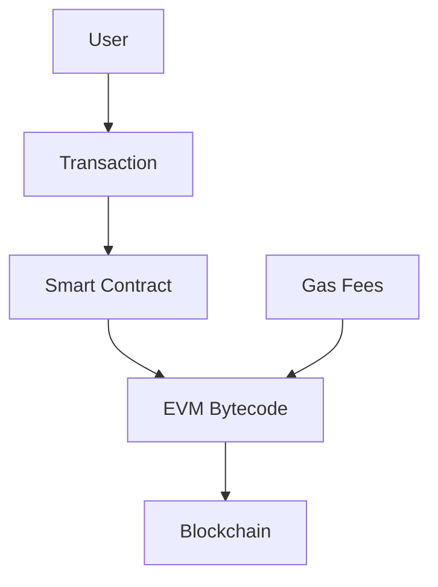
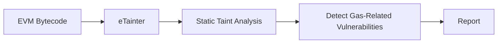
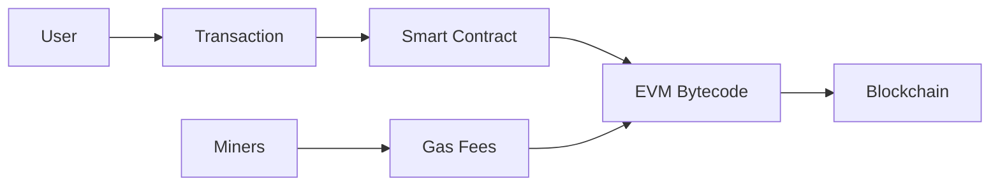
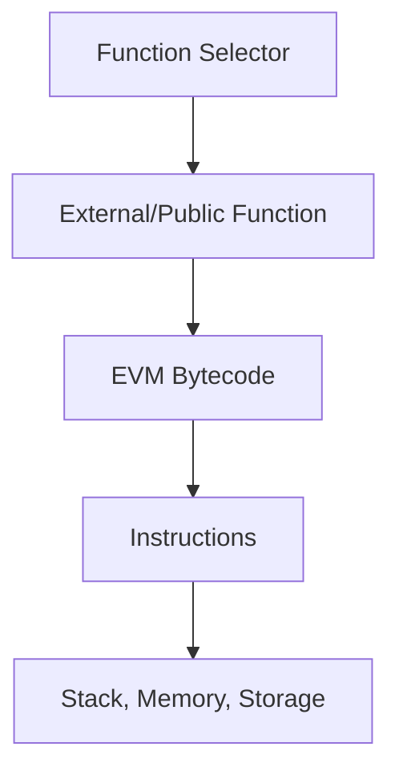
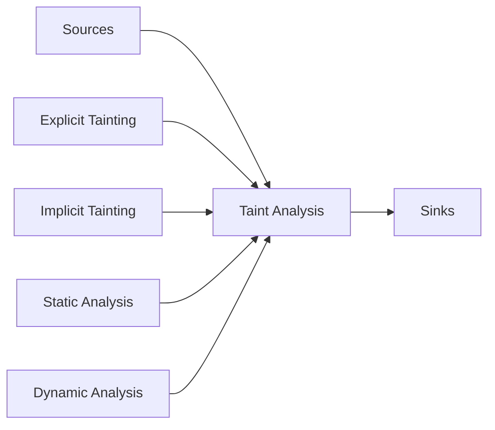
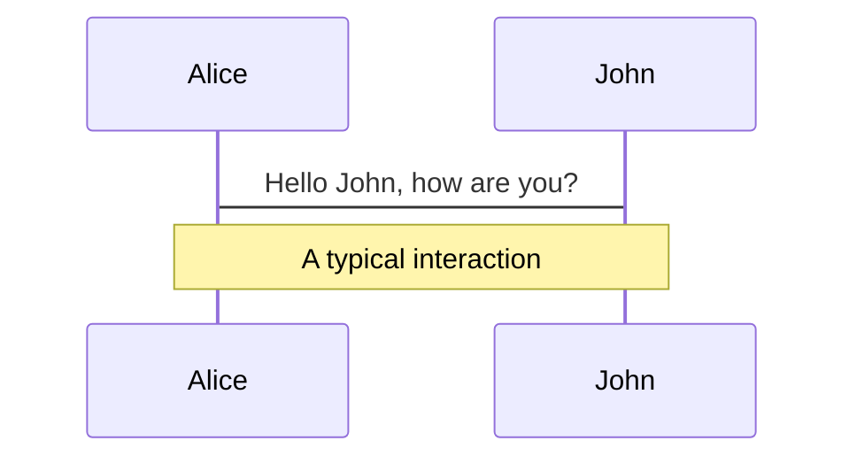
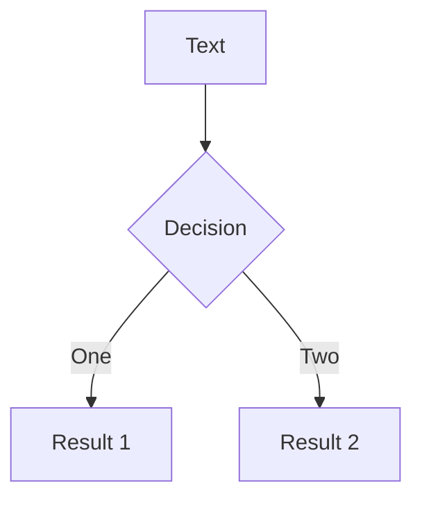
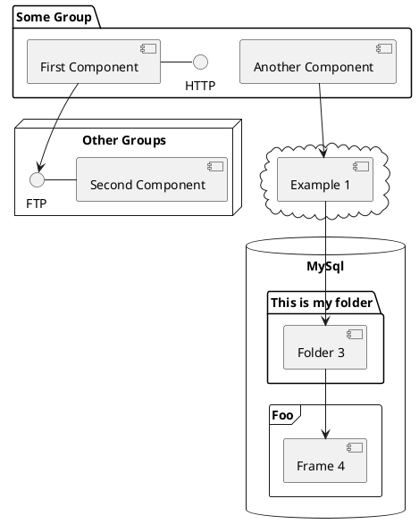

---
# try also 'default' to start simple
theme: seriph
# random image from a curated Unsplash collection by Anthony
# like them? see https://unsplash.com/collections/94734566/slidev
background: https://source.unsplash.com/collection/94734566/1920x1080
# apply any windi css classes to the current slide
class: 'text-center'
# https://sli.dev/custom/highlighters.html
highlighter: shiki
# show line numbers in code blocks
lineNumbers: true
# some information about the slides, markdown enabled
info: |
  ## Slidev Starter Template
  Presentation slides for developers.

  Learn more at [Sli.dev](https://sli.dev)
# persist drawings in exports and build
drawings:
  persist: false
# page transition
transition: slide-left
# use UnoCSS
css: unocss
---

# eTainter: Detecting Gas-Related Vulnerabilities in Smart Contracts

By

Sourena Khanzadeh

<div class="abs-br m-6 flex gap-2">
  <button @click="$slidev.nav.openInEditor()" title="Open in Editor" class="text-xl slidev-icon-btn opacity-50 !border-none !hover:text-white">
    <carbon:edit />
  </button>
  <a href="https://github.com/sourenaKhanzadeh/etainter" target="_blank" alt="GitHub"
    class="text-xl slidev-icon-btn opacity-50 !border-none !hover:text-white">
    <carbon-logo-github />
  </a>
</div>

<!--
The last comment block of each slide will be treated as slide notes. It will be visible and editable in Presenter Mode along with the slide. [Read more in the docs](https://sli.dev/guide/syntax.html#notes)
-->

---
transition: slide-left
---

# Table of Contents

Presentation structure

- 📝 **Abstract**
- 🎨 **Introduction** 
- 🧑‍💻 **Background** 
- 🤹 **Related Work** 
- 🎥 **Proposed Methodology**
- 📤 **Evaluation** 
- 🛠 **Conclsion** 

<br>
<br>

You can find the presentation slides [https://sourenakhanzadeh.github.io/etainter](https://sourenakhanzadeh.github.io/etainter)

<!--
You can have `style` tag in markdown to override the style for the current page.
Learn more: https://sli.dev/guide/syntax#embedded-styles
-->

<style>
h1 {
  background-color: #2B90B6;
  background-image: linear-gradient(45deg, #4EC5D4 10%, #146b8c 20%);
  background-size: 100%;
  -webkit-background-clip: text;
  -moz-background-clip: text;
  -webkit-text-fill-color: transparent;
  -moz-text-fill-color: transparent;
}
</style>

<!--
Here is another comment.
-->

---
transition: slide-right
---

# Abstract

This is a summary of the papers abstract.

<kbd> Keywords </kbd>

The execution of <kbd>smart contracts</kbd> on the <kbd>Ethereum blockchain</kbd> consumes <kbd>gas</kbd>, which may lead to <kbd>gas-related vulnerabilities</kbd> if there is insufficient gas provided. These vulnerabilities can be exploited for malicious purposes, such as <kbd>Denial-of-Service (DoS) attacks</kbd>. This paper introduces <kbd>eTainter</kbd>, a static analyzer that detects gas-related vulnerabilities using <kbd>taint tracking</kbd> in the bytecode of smart contracts. eTainter outperforms the previous work, <kbd>MadMax</kbd>, in precision and recall with a precision of 90%. A large-scale analysis of 60,612 real-world Ethereum contracts reveals that gas-related vulnerabilities exist in 2,763 contracts, and eTainter takes an average of eight seconds to analyze a contract.

---
layout: image-right
image: https://source.unsplash.com/collection/94734566/1920x1080
transition: slide-left
---

# Introduction

Problem statement

- Ethereum smart contracts and gas fees
- Gas-related vulnerabilities and their impact
- Limitations of current tools

<Transform :scale="0.8">

</Transform>

<!-- 
  today we will be discussing the challenges surrounding Ethereum smart contracts, gas fees, and the gas-related vulnerabilities that can negatively impact these contracts. Let's begin by understanding the problem statement.

As we can see from the diagram, when a user submits a transaction to interact with a smart contract, it gets executed on the Ethereum blockchain. During this execution, gas fees are consumed. These gas fees are essential for the proper functioning of the contract and prevent abuse of the system.

However, there is a downside. Smart contracts may contain gas-related vulnerabilities, which can lead to unexpected issues and unwanted behaviors. For instance, if there isn't enough gas provided for a transaction, the execution may halt, and any changes made during the execution will be reverted.

The problem is further exacerbated when malicious actors exploit these vulnerabilities to launch Denial-of-Service (DoS) attacks on the targeted victim contracts. This highlights the need for efficient tools to detect and prevent such gas-related vulnerabilities in smart contracts.

Unfortunately, current tools for detecting these vulnerabilities have limitations. They often rely on pre-specified code templates and rules, which can lead to false positives and a lack of accuracy in identifying the vulnerabilities.

In the next slides, we'll discuss a novel solution called eTainter that aims to address these limitations and effectively detect gas-related vulnerabilities in Ethereum smart contracts.
 -->

---
layout: image-left
image: https://source.unsplash.com/collection/94734566/1920x1080
transition: slide-right
---

# Introduction (cont.)
Proposed Solution

- Efficient static-analysis-based approach
- Formulates detection as a taint analysis problem
- Tracks taints through contract's storage and multiple entry points
- Domain-specific optimizations to reduce false-positives




<!-- 
  Now that we've discussed the problem statement, let's dive into our proposed solution called eTainter, which is designed to address the limitations of existing tools and effectively detect gas-related vulnerabilities in Ethereum smart contracts.

eTainter is an efficient static-analysis-based approach that formulates the detection of gas-related vulnerabilities as a taint analysis problem. By tracking taints through a contract's storage and multiple entry points, it can accurately identify vulnerabilities that may lead to issues like DoS attacks.

One of the key aspects of eTainter is its domain-specific optimizations, which help reduce false positives and improve the overall accuracy of vulnerability detection.

Let's take a closer look at the workflow of eTainter as shown in the diagram:

1. eTainter takes the EVM bytecode of a smart contract as input.
2. It then performs static taint analysis on the bytecode to identify potential vulnerabilities.
3. The analysis helps detect gas-related vulnerabilities that could be exploited by malicious actors.
4. Finally, eTainter generates a report outlining the identified vulnerabilities, enabling developers to take corrective action before deploying the smart contract on the Ethereum blockchain.

By using eTainter, we can better understand the gas-related vulnerabilities in our smart contracts and take necessary precautions to prevent unwanted behavior and potential attacks. In the next slides, we'll discuss the evaluation and results of eTainter and how it compares to existing tools in the field.
 -->

---
transition: fade-out
---

# Background

Ethereum Smart Contracts

- Distributed computing platform
- Stack-based Ethereum Virtual Machine (EVM)
- Persistent private key-value storage
- Volatile memory
- EVM bytecode executed through transactions



<!-- 
  Ethereum is a distributed computing platform that allows developers to create and deploy smart contracts. These contracts are executed in a stack-based Ethereum Virtual Machine, or EVM, which is a Turing-complete virtual machine designed specifically for Ethereum.

One of the key features of EVM is its support for persistent private key-value storage. This storage allows smart contracts to maintain data across multiple executions, enabling them to perform more complex operations and maintain state.

Additionally, EVM provides volatile memory that gets initialized at the beginning of each contract execution. This memory is used for temporary storage and calculations during the contract's execution.

Smart contracts on the Ethereum network are compiled into EVM bytecode, which is then executed through transactions. These transactions are submitted by users and processed by a network of miners, who compete to validate and include them in the blockchain.

As a part of this process, miners receive execution fees called gas, which are paid by users submitting the transactions. These gas fees help to maintain the network's security and incentivize miners to participate in the validation process.

In this diagram, you can see the flow from a user submitting a transaction, through the execution of the smart contract's EVM bytecode, and finally, the updating of the blockchain. You can also see the role of miners and the gas fees they receive for their work.


 -->

---
transition: fade-out
layout: two-cols
---

# Background (cont.)

EVM ByteCode

- Multiple entry points with function selector
- Instructions work on data from stack, memory, or storage
- EVM manages persistent data with SLOAD and SSTORE instructions
- Arithmetic, logic, and control transfer instructions
- No method invocation and return instructions

::right::



<!-- 
  Unlike traditional programs that have a single main entry point, EVM bytecode starts with a function selector, which provides multiple entry points for the contract. This function selector acts as an entry gate, routing the execution to the appropriate external or public function based on the provided function signature.

In the EVM, instructions work on data from three primary sources: the stack, memory, or storage. These instructions perform various operations, including loading and storing data, managing memory, and manipulating control flow.

Two key instructions for managing persistent data in the contract storage are SLOAD and SSTORE. These instructions read and write data to the contract's storage, with the corresponding storage addresses being supplied from the stack.

EVM bytecode also includes arithmetic, logic, and control transfer instructions that enable complex computations and decision-making within the smart contract.

One important aspect to note is that EVM bytecode does not have specific method invocation and return instructions to perform intra-contract function calls. Instead, the EVM pushes the return address to the stack and performs a direct jump to the target address of the method within the bytecode.

The diagram on the right illustrates the process, starting with the function selector, moving through the EVM bytecode execution, and finally, the interaction with the stack, memory, and storage.
 -->

---
transition: fade-out
---

<table>
<thead>
    <tr>
        <th>Instruction</th>
        <th>Description</th>
        <th>Opcode</th>
    </tr>
</thead>
<tbody>
    <tr>
        <td>ADD</td>
        <td>Addition operation</td>
        <td>0x01</td>
    </tr>
    <tr>
        <td>MUL</td>
        <td>Multiplication operation</td>
        <td>0x02</td>
    </tr>
    <tr>
        <td>SUB</td>
        <td>Subtraction operation</td>
        <td>0x03</td>
    </tr>
    <tr>
        <td>GT</td>
        <td>Greater-than comparison</td>
        <td>0x11</td>
    </tr>
    <tr>
        <td>EQ</td>
        <td>Equality comparison</td>
        <td>0x14</td>
    </tr>
    <tr>
        <td>JUMPI</td>
        <td>Conditional jump</td>
        <td>0x57</td>
    </tr>
    <tr>
        <td>CALL</td>
        <td>Call another contract</td>
        <td>0xF1</td>
    </tr>
    <tr>
        <td>STOP</td>
        <td>Stop execution</td>
        <td>0x00</td>
    </tr>
    <tr>
        <td>REVERT</td>
        <td>Revert changes made during execution</td>
        <td>0xFD</td>
    </tr>
</tbody>
</table>

<style>
        table {
            border-collapse: collapse;
            width: 100%;
        }
        th, td {
            border: 1px solid black;
            padding: 8px;
            text-align: left;
        }
        th {
            background-color: #f2f2f2;
        }
</style>

---
transition: fade-out
layout: two-cols
---
# Background (cont.)

Taint Analysis

- Used for information-flow-based security
- Identifies data-flow from low-integrity data (sources) to high-integrity data (sinks)
- Explicit and implicit tainting
- Static and dynamic taint analysis
- Static analysis: potentially imprecise but sound
- Dynamic analysis: precise but limited coverage

::right::



<!-- 
  Taint analysis is employed to identify data flows from low-integrity data, known as sources, to high-integrity data, referred to as sinks. When data flows from sources to sinks, it can potentially represent a vulnerability in the system.

There are two forms of tainting: explicit and implicit. Explicit tainting only considers direct data flows from sources to sinks, without accounting for control flows. Implicit tainting, on the other hand, takes into account indirect tainting through control flows, making it necessary for a sound analysis.

Taint analysis can be performed in two ways: statically or dynamically. Static taint analysis techniques may be imprecise, leading to false positives. However, they are generally sound, meaning they cover all potential taint flows in the program and have no false negatives. Dynamic taint analysis, in contrast, is precise and has no false positives, but its coverage is limited by the inputs provided for executing the program, making it unsound and potentially leading to false negatives.

The diagram on the right showcases the flow of taint analysis, starting with sources, moving through the various forms of tainting and analysis methods, and ending at sinks.
 -->

---
transition: fade-out
layout: two-cols
---
# Background (cont.)

Motivating Example

- Real-world Ethereum contract (PIPOT)
- Lottery game with tickets and bet price
- Users participate by calling buyTicket
- Owner starts a new game with start function
- Vulnerabilities: unbounded loop and DoS with Failed Call
- Current tools (e.g., MadMax) fail to detect these vulnerabilities

::right::

```solidity
contract PIPOT {
  uint public fee = 20; mapping(uint => uint) jackpot;
  struct order{ address player; uint betPrice;}
  mapping(uint => order[]) orders;
  function buyTicket(uint betPrice)public payable{
    orders[game].push(order(msg.sender, betPrice)); 
    uint distribute = msg.value * fee / 100; 
    jackpot[game] += (msg.value - distribute);
  }
  function start(uint winPrice)public onlyOwner(){
    if (orders[game].length > 0) { 
      pickTheWinner(winPrice);
    }
    startGame(); 
  }

  function pickTheWinner(uint winPrice) internal { 
    uint toPlayer = jackpot[game]/orders[game].length; 
    for(uint i=0; i<orders[game].length;i++){
      if (orders[game][i].betPrice == winPrice){ 
        orders[game][i].player.transfer(toPlayer);
      }
    } 
}
```

<!-- 
We will focus on a real-world contract called PIPOT, which implements a lottery game where users can participate by buying tickets and guessing a bet price.

In the PIPOT contract, users participate in the game by calling the buyTicket function, while the owner of the contract can start a new game by calling the start function. The contract, however, has two significant vulnerabilities: unbounded loop and DoS with Failed Call.

The unbounded loop vulnerability occurs when the pickTheWinner function iterates through the dynamic mapping orders in a for-loop. If a large number of players participate in the game, the loop will fail, and the jackpot money will be locked in the contract forever.

The DoS with Failed Call vulnerability occurs when the pickTheWinner function sends money to the winners within the loop. If one of the winners fails to receive the money, the whole loop will fail, and the jackpot money will be locked in the contract forever.

Current tools, such as MadMax, are unable to detect these vulnerabilities, illustrating the need for a more efficient and robust approach to identifying gas-related vulnerabilities in Ethereum smart contracts.
 -->
---
transition: fade-out
layout: two-cols
---
# Background (cont.)

Vulnerabilities in PIPOT Contract

1. Unbounded Loop
   - Loop iterates through dynamic mapping orders
   - Large number of players causes loop to fail
   - Jackpot money locked in contract forever

2. DoS with Failed Call
   - Money sent to winners within the loop
   - One winner failing to receive locks jackpot money in contract

::right::

```solidity
function pickTheWinner(uint winPrice) internal { 
    uint toPlayer = jackpot[game]/orders[game].length; 
    for(uint i=0; i<orders[game].length;i++){
      if (orders[game][i].betPrice == winPrice){ 
        orders[game][i].player.transfer(toPlayer);
      }
    } 
}
```

<!-- 
  In this slide, we will take a closer look at the two vulnerabilities present in the PIPOT contract: Unbounded Loop and DoS with Failed Call. These vulnerabilities are related to the pickTheWinner function, which is responsible for distributing the jackpot to the winners.

1. Unbounded Loop:
  The unbounded loop vulnerability occurs in the pickTheWinner function when it iterates through the dynamic mapping orders using a for-loop. As the number of players increases, the loop may fail due to exceeding the block gas limit, preventing the winners from receiving their prize money. Consequently, the jackpot money remains locked in the contract forever.
2. DoS with Failed Call:
  The DoS with Failed Call vulnerability arises when the pickTheWinner function sends money to the winners within the loop. If one of the winners is unable to receive the money, perhaps due to a failed call or an exception, the entire loop will fail. This results in none of the winners receiving the jackpot, and the jackpot money becomes locked in the contract indefinitely.

These vulnerabilities demonstrate the importance of identifying and addressing gas-related vulnerabilities in Ethereum smart contracts to ensure their security and reliability.
 -->

---
transition: fade-out
---

# Background (cont.)

Limitations of Current Tools

- MadMax tool fails to detect vulnerabilities in PIPOT contract
- Relies on pre-specified rules
- Unable to handle nested structures
- Difficult to express many variations as pre-specified rules


<!-- 
  n this slide, we will discuss the limitations of current tools, specifically focusing on the MadMax tool and its inability to detect the vulnerabilities in the PIPOT contract.

MadMax, a popular tool for detecting gas-related vulnerabilities, failed to identify the unbounded loop and DoS with Failed Call vulnerabilities in the PIPOT contract. The primary reason for this is its reliance on pre-specified rules to identify vulnerabilities.
The pre-specified rules in MadMax are not flexible enough to handle nested structures, such as multi-dimensional arrays, which are present in the PIPOT contract example. The rules used by MadMax for detecting vulnerabilities do not work well with these complex data structures, leading to missed vulnerabilities.

Another limitation of using pre-specified rules is that it's difficult to express many variations and edge cases as rules. This means that even if the rules are modified to handle a specific case, there are likely other variations that the tool cannot detect.
In conclusion, the limitations of current tools like MadMax highlight the need for more advanced and flexible approaches to detecting gas-related vulnerabilities in Ethereum smart contracts.
 -->

---
transition: fade-out
layout: two-cols
---

# Background (cont.)

Taint Sources in EVM Analysis

- EVM instructions introducing user data as taint sources
  - CALLDATALOAD, CALLDATACOPY, CALLER, ORIGIN, CALLVALUE
- EVM instruction SLOAD loads data from contract's storage
  - Initially considered tainted data
  - Further checks validate if storage sources are user-controlled

::right::

<Transform :scale="0.8">
Table 1: EVM Instructions as Taint Sources

| EVM Instruction |     Description       |
|-----------------|-----------------------|
| CALLDATALOAD    | Read function argument |
| CALLDATACOPY    | Copy function argument |
| CALLER          | Transaction sender    |
| ORIGIN          | Transaction origin    |
| CALLVALUE       | Ether value           |
| SLOAD           | Load data from storage |


```solidity
function buyTicket(uint betPrice) public payable {
  ...
  orders[game].push(order(msg.sender, betPrice));
  ...
}
...
for (uint i = 0; i < orders[game].length; i++) {
  ...
}
```
</Transform>

<!-- 
  In this slide, we discuss the taint sources used in EVM analysis. These are the EVM instructions that introduce user data as taint sources:

- CALLDATALOAD and CALLDATACOPY read data passed as arguments when calling a contract's function.
- CALLER and ORIGIN return the sender and the origin of the transaction, respectively.
- CALLVALUE returns the Ether value of the transaction.

Additionally, the EVM instruction SLOAD loads data from the contract's storage. Although initially considered tainted data, further checks are performed to validate if storage sources are controlled by the contract users.

To the right, you can see a table listing these EVM instructions along with their descriptions. In our example, the 'buyTicket' function processes the 'betPrice' parameter, and the 'orders' mapping uses the 'msg.sender' value. The length of the 'orders' array is read by the SLOAD instruction in the bytecode.
 -->

---
transition: fade-out
---

# Background (cont.)

Gas-Related Vulnerabilities (1/2)


1. Unbounded Loops
  - Occurs when a loop iteration is determined by user input.
  - Can cause Denial of Service (DoS) due to loops bound by storage data items.
  - Example: line 21 in Figure 1.
2. Implicit Loops
  - Generated due to Solidity programming patterns.
  - Example: creditorAddresses = new address.

**Detection for Unbounded Loops**

- Define the loop condition as a sink.
-  Check if taint sources (data loaded from storage slots written or manipulated by contract users) reach the defined sink.


<!-- 
  In this slide, we will discuss two types of gas-related vulnerabilities.

First, we have Unbounded Loops, which occur when a loop iteration depends on user input. This can cause a Denial of Service, or DoS, when loops are bound by storage data items. An example of this can be found at line 21 in Figure 1.

Second, we have Implicit Loops, which are generated due to Solidity programming patterns. A common example is when developers clear arrays using the pattern "creditorAddresses = new address".

To detect unbounded loops, we can use taint analysis. We define the loop condition as a sink and check if taint sources, such as data loaded from storage slots written or manipulated by contract users, reach the defined sink.
 -->

---
transition: fade-out
---

# Background (cont.)

Gas-Related Vulnerabilities (2/2)

1. DoS with Failed Call
  - Occurs when external calls are performed in the loop body (e.g., to pay users by sending Ether to several addresses).
  - Can cause the whole execution to get reverted and the loop never completes.
  - Example: loop in Figure 1 (line 21) with transfer (line 23).

**Detection for DoS with Failed Call**

- Define the target address of a call executed in the loop's body as a sink if the return of the call is the condition of a revert statement in the loop's body.
- Check if taint sources (user-defined data loaded from storage) can reach the sink.


<!-- 
  Continuing with gas-related vulnerabilities, we have the DoS with Failed Call vulnerability. This occurs when external calls are performed within a loop body, such as paying users by sending Ether to multiple addresses. This can cause the entire execution to be reverted, and the loop never completes. An example of this is the loop found at line 21 in Figure 1, with the transfer function at line 23.

To detect the DoS with Failed Call vulnerability, we can use taint analysis. We define the target address of a call executed in the loop's body as a sink if the return of the call is the condition of a revert statement in the loop's body. Then, we check if taint sources, such as user-defined data loaded from storage, can reach the sink.
 -->


---
transition: slide-left
---

# Proposed Methodology

Taint Analysis Approach for Detecting Gas-Related Vulnerabilities

- Input: EVM bytecode of the smart contract
- Builds Control Flow Graph (CFG)
- Identifies taint sources and sinks
- Extracts CFG paths leading to sinks
- Performs taint analysis on paths
- Excludes protected vulnerabilities
- Reports found vulnerabilities and vulnerable functions


<!-- 
  eTainter takes the EVM bytecode of the smart contract as input and performs the following steps: It builds a Control Flow Graph (CFG), identifies taint sources and sinks, extracts CFG paths leading to the defined sinks, and performs taint analysis on these paths. eTainter then identifies and excludes protected vulnerabilities, reporting the found vulnerabilities and vulnerable functions to the users."
 -->

---
transition: slide-left
---

# Proposed Methodology (cont.)

Control Flow Graph Construction and Extracting Vulnerable Paths

- Constructs a context-sensitive, inter-procedural CFG
- Represents all functions and their interactions
- Identifies paths leading to gas-related vulnerabilities
- Propagates taints through stack, memory, and storage
- Checks for protective patterns


<!-- 
  In order to perform taint analysis, eTainter first constructs a context-sensitive, inter-procedural CFG, which represents all functions in the contract and their interactions. eTainter identifies paths that lead to gas-related vulnerabilities and propagates taints through the stack, memory, and storage based on the semantics of the EVM instructions. Additionally, eTainter checks for protective patterns that might mitigate the identified vulnerabilities.
 -->

---
transition: slide-left
---

# Proposed Methodology (cont.)

Taint Propagation Rules

- Rule-1: If any operand is tainted, the derived value is tainted.
- Rule-2: No taint propagation for instructions querying blockchain state or writing to the blockchain (excluding SSTORE).
- Rule-3: If data read from memory or storage is tainted, the result value is tainted.


<!-- 
  eTainter utilizes three main taint propagation rules during the analysis process. Rule-1 states that if any operand is tainted, the derived value is also tainted. Rule-2 indicates that no taint propagation occurs for instructions querying blockchain state or writing to the blockchain, excluding the SSTORE instruction. Finally, Rule-3 specifies that if the data read from memory or storage is tainted, the resulting value is tainted as well
 -->

---
transition: slide-left
---

# Proposed Methodology (cont.)

eTainter Implementation

- Automated tool working on EVM bytecode
- Generates bytecode using solc Solidity compiler
- Modified version of teETher used for CFG and computing backward slices
- Uses rattle framework for recovering Static Single Assignment (SSA) form of the bytecode
- Handles data overwrites through SSA form during taint analysis

<!-- 
  eTainter is implemented as an automated tool that works on the EVM bytecode of smart contracts. It generates bytecode using the solc Solidity compiler and employs a modified version of teETher for CFG generation and computing backward slices. Furthermore, eTainter uses the rattle framework for recovering the Static Single Assignment (SSA) form of the bytecode, which enables it to handle data overwrites during the taint analysis process more efficiently.
 -->

 
---

# Components

<div grid="~ cols-2 gap-4">
<div>

You can use Vue components directly inside your slides.

We have provided a few built-in components like `<Tweet/>` and `<Youtube/>` that you can use directly. And adding your custom components is also super easy.

```html
<Counter :count="10" />
```

<!-- ./components/Counter.vue -->
<Counter :count="10" m="t-4" />

Check out [the guides](https://sli.dev/builtin/components.html) for more.

</div>
<div>

```html
<Tweet id="1390115482657726468" />
```

<Tweet id="1390115482657726468" scale="0.65" />

</div>
</div>

<!--
Presenter note with **bold**, *italic*, and ~~striked~~ text.

Also, HTML elements are valid:
<div class="flex w-full">
  <span style="flex-grow: 1;">Left content</span>
  <span>Right content</span>
</div>
-->


---
class: px-20
---

# Themes

Slidev comes with powerful theming support. Themes can provide styles, layouts, components, or even configurations for tools. Switching between themes by just **one edit** in your frontmatter:

<div grid="~ cols-2 gap-2" m="-t-2">

```yaml
---
theme: default
---
```

```yaml
---
theme: seriph
---
```


</div>

Read more about [How to use a theme](https://sli.dev/themes/use.html) and
check out the [Awesome Themes Gallery](https://sli.dev/themes/gallery.html).

---
preload: false
---

# Animations

Animations are powered by [@vueuse/motion](https://motion.vueuse.org/).

```html
<div
  v-motion
  :initial="{ x: -80 }"
  :enter="{ x: 0 }">
  Slidev
</div>
```

<div class="w-60 relative mt-6">
  <div class="relative w-40 h-40">
    
    
    
  </div>

  <div
    class="text-5xl absolute top-14 left-40 text-[#2B90B6] -z-1"
    v-motion
    :initial="{ x: -80, opacity: 0}"
    :enter="{ x: 0, opacity: 1, transition: { delay: 2000, duration: 1000 } }">
    Slidev
  </div>
</div>

<!-- vue script setup scripts can be directly used in markdown, and will only affects current page -->
<script setup lang="ts">
const final = {
  x: 0,
  y: 0,
  rotate: 0,
  scale: 1,
  transition: {
    type: 'spring',
    damping: 10,
    stiffness: 20,
    mass: 2
  }
}
</script>

<div
  v-motion
  :initial="{ x:35, y: 40, opacity: 0}"
  :enter="{ y: 0, opacity: 1, transition: { delay: 3500 } }">

[Learn More](https://sli.dev/guide/animations.html#motion)

</div>

---

# LaTeX

LaTeX is supported out-of-box powered by [KaTeX](https://katex.org/).

<br>

Inline $\sqrt{3x-1}+(1+x)^2$

Block
$$
\begin{array}{c}

\nabla \times \vec{\mathbf{B}} -\, \frac1c\, \frac{\partial\vec{\mathbf{E}}}{\partial t} &
= \frac{4\pi}{c}\vec{\mathbf{j}}    \nabla \cdot \vec{\mathbf{E}} & = 4 \pi \rho \\

\nabla \times \vec{\mathbf{E}}\, +\, \frac1c\, \frac{\partial\vec{\mathbf{B}}}{\partial t} & = \vec{\mathbf{0}} \\

\nabla \cdot \vec{\mathbf{B}} & = 0

\end{array}
$$

<br>

[Learn more](https://sli.dev/guide/syntax#latex)

---

# Diagrams

You can create diagrams / graphs from textual descriptions, directly in your Markdown.

<div class="grid grid-cols-3 gap-10 pt-4 -mb-6">







</div>

[Learn More](https://sli.dev/guide/syntax.html#diagrams)

---
src: ./pages/multiple-entries.md
hide: false
---

---
layout: center
class: text-center
---

# Learn More

[Documentations](https://sli.dev) · [GitHub](https://github.com/slidevjs/slidev) · [Showcases](https://sli.dev/showcases.html)
